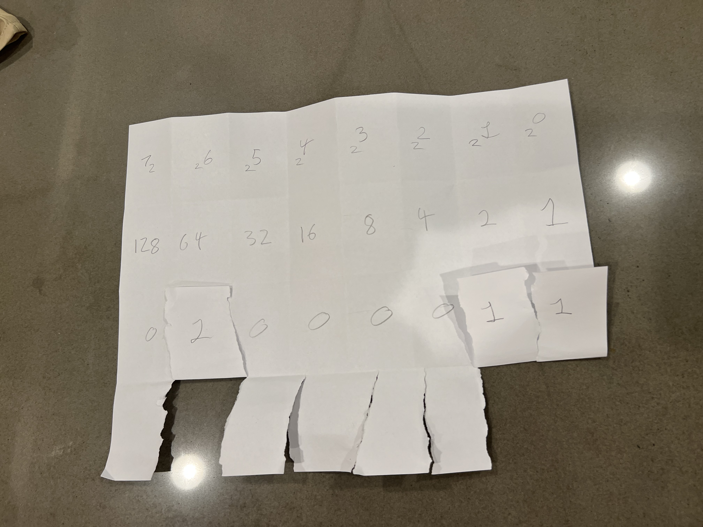

# Binary

Today we talked about binary and made Flippy Do's which help visualize how
numbers are represented in binary. For the last part of class we played the
binary game to memorize the values of numbers in base two for our quiz at
the beginning of next class.

### Picture of my Flippy Do
