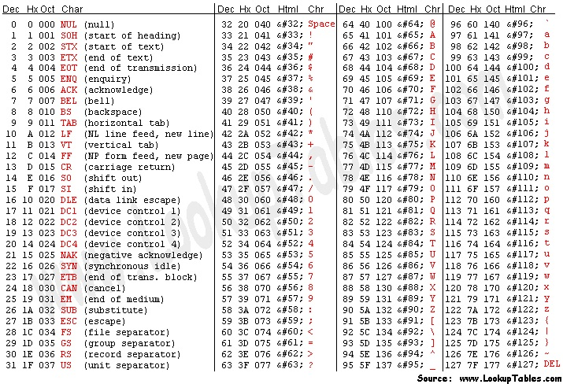
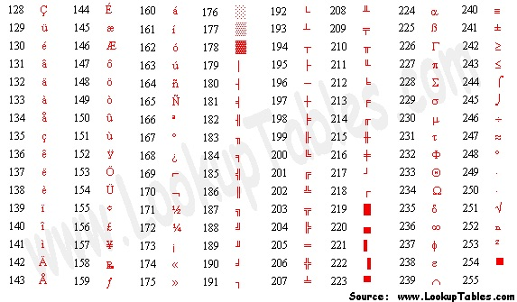

# Introduction to ascii and logic

Today we learned about how computers interpret and handle text in binary, as well as how to do simple math operations in binary.

## Ascii

Ascii is the American Standard encoding for text. It was first introduced in 1963 in order to increase compatibilty between files. Before the introduction of ascii, files created on one computer could only be viewed and executed properly on that specific model and/or type of computer meaning that software had to be rewritten for each combination of hardware, which was many times more difficult for developers than it is today after the introduction of ascii. After it's establishment, it continued to undergo changes as the standards were updated to support new characters and functions.

### Timeline

<iframe src='https://cdn.knightlab.com/libs/timeline3/latest/embed/index.html?source=v2%3A2PACX-1vRxkf9Bwbh-g2WV4oPGKFd-ts6K6wT-rNb8M8d_rm1YQ7gpZ4cBOlVUiSlFBVjn90GOGwXKK1Y-HNQZ&font=Default&lang=en&initial_zoom=2&width=100%25&height=450' width='100%' height='450' webkitallowfullscreen mozallowfullscreen allowfullscreen frameborder='0'></iframe>
<!---->

#### The full modern ASCII character set

## Binary operations

We started to learn how to use simple mathematic operations in binary, such as addition and substraction

<footer>

  

    This page uses 
    <a href="https://timeline.knightlab.com/" target="_blank" rel="noopener">TimelineJS</a>, 
    which is licensed under the 
    <a href="https://www.mozilla.org/en-US/MPL/2.0/" target="_blank" rel="noopener">Mozilla Public License, version 2.0</a>. 
    TimelineJS is copyrighted © 2025 Northwestern University.
  

</footer>